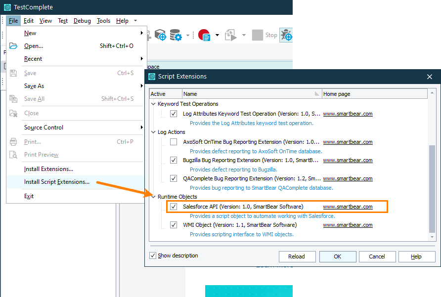
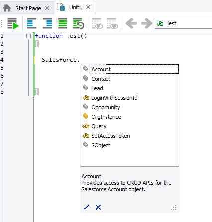
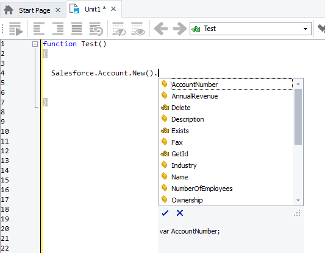

# Salesforce API Extension
[Salesforce](https://www.Salesforce.com/) is a cloud-based customer relationship management solution. It includes services for managing customers, cases, sales opportunities, and so on.
The **Salesforce API** script extension for [TestComplete](https://smartbear.com/product/testcomplete/overview/) simplifies working with Salesforce resources from TestComplete tests. The extension provides a wrapper for the most commonly used Salesforce API operations.

## Table of contents

* [Requirements](#requirements)
* [Install and enable the extension](#install)
    * [1. Build the extension](#build)
    * [2. Install and enable the extension](#enable)
* [Use the extension](#use)
* [How to use](#how-to)
    * [1. Log in](#log-in)
    * [2. Access objects and send queries](#access)
    * [Queries](#queries)
* [Known issues and limitations](#known-issues)
* [Advanced example - Add data to Salesforce from an external file](#advanced-example)
    * [JavaScript example](#javascript)
    * [Python example](#python)
* [Reference](#reference)
    * [`Salesforce` object](#salesforce-object)
    * [`Account`, `Contact`, `Lead`, `Opportunity`, `SObject` objects](#objects)
    * [Record objects](#record-objects)
* [Support](#support)

<a name="requirements"></a>
## Requirements
For the extension to be able to access the Salesforce resources by using the API, the following requirements must be met:

* Your Salesforce edition must allow API access. It can be one of the following editions:
	* Enterprise
	* Unlimited
	* Developer
	* Performance
* The Salesforce account you are going to use in your tests must be signed up for a Salesforce Develop Edition organization. See [Obtain a Salesforce Developer Edition Organization](https://developer.salesforce.com/docs/atlas.en-us.api_rest.meta/api_rest/quickstart_dev_org.htm).
* The API Enabled permission must be enabled for your Salesforce account. To learn how to enable the permission, please see the [Salesforce documentation](https://help.salesforce.com/articleView?id=sf.admin_userperms.htm&type=5).

<a name="install"></a>
## Install and enable the extension

<a name="build"></a>
### 1. Build the extension
1.	Clone the repository from GitHub to your computer.
2.	Run **build.bat** that comes with the extension files and resides in the repository root folder. It will compile the extension files into a single **SalesForce.tcx** file.

<a name="enable"></a>
### 2. Install and enable the extension
1.	If you have any running instances of TestComplete (or TestExecute), close them.
2.	Double-click the generated **SalesForce.tcx** file and follow the instructions to install the extension.
3.	After the extension is installed, you can start TestComplete (or TestExecute).
To make sure that the extension is installed correctly, locate it in the **File > Install Script Extensions** dialog in TestComplete. The extension belongs to the **Runtime Objects** group:



<a name="use"></a>
## Use the extension
The extension provides the `Salesforce` objects you can use in your TestComplete tests to access Salesforce resources: **objects** available to your organization (they correspond to database tables) and individual **records** for these objects (they correspond to table rows).



Use the object to:

* Create, update, and delete records for the standard `Account`, `Contact`, `Lead`, `Opportunity` objects, and other Salesforce objects.
* Run SOQL queries and get query results.

<a name="how-to"></a>
## How to use
<a name="log-in"></a>
### 1. Log in
Before you start working with Salesforce resources from TestComplete tests, provide your credentials to be able to access the Salesforce resources. You can do it in one of the following ways.

#### With session ID
Use the `Salesforce.LoginWithSessionId` method to send the following credentials to Salesforce and get access to Salesforce resources:

```js
// JavaScript example
function Login_SessionID()
{
  // Log in via session ID
  let username = "tester@example.com";
  let password = "password1";
  let clientID = "1234";
  let clientSecret = "1234";
  let token = "1234";

  Salesforce.OrgInstance = "https://my_sample.Salesforce.com";
  Salesforce.LoginWithSessionId(clientID, clientSecret, username, password, token);
  
}
```
- `username` and `password` - This is the email and password used to register your Salesforce account.
- `clientID` and `clientSecret` - This is the Customer ID and Customer Secret of your Salesforce Connected App. You can get them on the Connected App page of the Salesforce web interface.
- `token` - You can get the security token in the email you received from Salesforce upon registering your account.
- `OrgInstance` - Your Salesforce organization instance, in the https://[your_instance].Salesforce.com format.

#### With Access token
As an alternative, you can use the access token. You get the access token from a response that your authentication server sends to your Salesforce callback URL on a login request. To learn more, please see the [Salesforce REST API developer guide](https://developer.Salesforce.com/docs/atlas.en-us.api_rest.meta/api_rest/quickstart_oauth.htm).

```js
// JavaScript example
function Login_AccessToken()
{
  // Log in via access token
  let accessToken = "1a2b3c"; 
  Salesforce.SetAccessToken(accessToken);
 
}
```
<a name="access"></a>
### 2. Access objects and send queries
#### Account, Contact, Lead, and Opportunity objects
To work with the standard `Account`, `Contact`, `Lead`, and `Opportunity` objects, you can use the appropriate properties of the `Salesforce` object:

* `Salesforce.Account`
* `Salesforce.Contact`
* `Salesforce.Lead`
* `Salesforce.Opportunity`

The following sample code shows how to create a new record of the `Account` object and send it to the server:


```js
// JavaScript example
function Create_Record()
{
  // Create a record for the Account object
  let accountObj = Salesforce.Account.New();
  // Set fields of the created record
  accountObj.Name = "Jane Smith";
  accountObj.Phone = "555-555-5555";
  // ...

  // Send the record to the server
  accountObj.Send(true);

}
```

To create a new record for the object, use the `New` method of the appropriate object. To set fields of the created record, use the properties of the created record. 
The created record will be available only locally, in your TestComplete test. To send the record to the server, use the `Send` method.


**Important**: The `Send` method can take `true` (default value) or `false` as a parameter. Depending on the parameter value:

- `true` - The method will add the created record to the server and then send an additional request to the server to update the created local record with the record data it will get from the server. This way, if the created record has any fields that were not specified, they will be initialized with values set on the server when the record is added there.
- `false` - The method will add the created record to the server, it will not send any additional requests to the server and will not update the created local record with the server data. If the created record has any fields that were not specified, they will remain unspecified.


#### Other Salesforce objects
To work with Salesforce objects other than the `Account`, `Contact`, `Lead`, or `Opportunity` objects, use the `Salesforce.SObject` method. To get the object, specify the object name.
The sample code below shows how to create a record for the `Location` object and send it to the server.

```js
// JavaScript example
function Create_Location()
{
  // Create a record for the Location object
  let locationObj = Salesforce.SObject("Location").New();
  // Set fields of the created record
  locationObj.Name = "New location";
  locationObj.LocationType = "Custom";
  // ...
  // Send the created record to the server
  locationObj.Send(true);
}
```
After updating the record in your test, send the data to the server by using the `Send` method. 

#### Update an existing record
To get an existing record from the server, use the `Salesforce.Get` method. Specify the needed record by its Id.
The following sample code shows how to get a record of the `Account` object by its Id, update its fields, and then update the record data on the server:

```js
// JavaScript example
function Update_Record()
{
  // Get the Account record by its Id
  let id = "123";
  let accountObj = Salesforce.Account.Get(id);
  
  // Set the Name field
  accountObj.Name = "Jane Smith";
  
  // Update the record on the server
  accountObj.Send();

}
```	

#### Fields and custom fields
To access the most commonly used fields of the `Account`, `Contact`, `Lead`, and `Opportunity` objects, use properties of the appropriate objects that the extension provides. You can view them in Code Completion of TestComplete while you are editing your tests:



The sample code below shows how to get an `Account` object record and post its `Name` field value to the test log:

```js
// JavaScript example
function Set_Field()
{
  // Get the Account record by its Id
  let id = "123";
  let accountObj = Salesforce.Account.Get(id);

  // Post the Name field to the test log 
  Log.Message(accountObj.Name);

}
```	


To get the list of all fields the object has, use the `GetFieldNames` method.
The sample code below shows how to get the list of all fields the `Account` object has:

```js
// JavaScript example
function Get_Fields()
{
  let names = Salesforce.Account.GetFieldNames();
  for (let i = 0; i < names.Count(); i++)
  {
    Log.Message(names.GetItem(i));
  }
  
}
```

To set a custom field, use the `SetCustomField` method:

```js
// JavaScript example
function Set_Field()
{
  let id = "123";
  let accountObj = Salesforce.Account.Get(id);
  // Set the CustomDescription field of the Account record
  accountObj.SetCustomField("CustomDescription", "This description is set by an automated test");
  //...
  accountObj.Send();
  
}
```
If the field with the specified name does not exist, the method will create it.
Note that values you assign to fields in your tests are available only locally. To make them available on the Salesforce server, use the `Send` method.

#### Check if the record exists
A record you create with the `New` method or get with the `Get` method is local. To check if the record exists on the Salesforce server, use the `Exists` method. This may be helpful if you need to check if the record has been deleted by another user:

```js
// JavaScript example
function Check_Record()
{

  let id = "123";
  let accountObj = Salesforce.Account.Get(id);

  //...

  if (accountObj.Exists())
  {
    //...
  }
  
}
```
<a name="queries"></a>
### Queries
Use the `Salesforce.Query` method to send SOQL queries to Salesforce:
```js
// JavaScript example
function Get_Names()
{
  let names = Salesforce.Query("SELECT+Name+FROM+Account");
  for (let i = 0; i < names.Count(); i++)
  {
    Log.Message(names.GetItem(i).Name);
  }
}
```
The object that the method returns provides access to the server response. If the query fails, the method will post an error message to the test log.

For detailed information on the query syntax, see [SOQL and SOSL Reference](https://developer.Salesforce.com/docs/atlas.en-us.soql_sosl.meta/soql_sosl/sforce_api_calls_soql_sosl_intro.htm) in the Salesforce Developer Guide.

<a name="known-issues"></a>
## Known issues and limitations
The VBScript and DelphiScript scripting languages do not support calling methods of the `Salesforce` object without parameters. The following will not work correctly:

```pascal
// DelphiScript example
procedure Test();
var accountObj;
begin
  accountObj := Salesforce.Account.New(); // <-- This will not work correctly and the next line will throw an error
  accountObj.Name := 'Jane Smith';
  //...
end;
```

To avoid possible issues, you can do any of the following:

* Use another supported scripting language to create your tests. We recommend that you use JavaScript or Python.
* Use the `CallMethod` method to call the needed methods. 

For example:

```pascal
// DelphiScript example
procedure Test();
var accountObj;
begin
  accountObj := Salesforce.Account.CallMethod('New');
  accountObj.Name := 'Jane Smith';
  //...
end;
```
<a name="advanced-example"></a>
## Advanced example - Add data to Salesforce from an external file
In TestComplete, it is possible to get input test data from an external file, a data source, for example, from an Excel file or a database. The sample code below shows how to create Account records with data retrieved from an Excel file and send the created records to Salesforce.

For the example to work correctly, specify the proper login information and the proper Excel file that stores the needed account data. You can use the sample Accounts.xlsx file that you can get from this repository.

The sample code comes as JavaScript and Python.

- [JavaScript](#javascript)
- [Python](#python)
- [Accounts.xlsx](./Accounts.xlsx)

<a name="javascript"></a>
### JavaScript example 
```js
// The example below shows how to create Accounts in Salesforce using data retrieved from an Excel file
function Send_Account_Data_from_Excel()
{
  // Salesforce account information
  // For the example to work correctly, specify the proper Salesforce credentials
  let username = "tester@example.com";
  let password = "password1";
  let token = "123";
  let user_instance = "https://my_Salesforce.Salesforce.com";

  // Salesforce connected app information
  // For the example to work correctly, specify the proper Id and Secret
  // You can find the Id and Secret on the Connected App page of the Salesforce web interface
  let client_id = "123";
  let client_secret = "123";
  
  // Excel file
  // For the example to work correctly, specify the proper path to the Excel file
  // that stores the Account information
  let path = "accounts.xlsx";  
  
  // Log in to Salesforce
  Salesforce.OrgInstance = user_instance;
  Salesforce.LoginWithSessionId(client_id, client_secret, username, password, token);
  
  // Open the Excel file to get account data from it
  let sheet = Excel.Open(path).SheetByTitle("Accounts");
   
  Log.AppendFolder("Add Accounts");
  
  // Iterate through the Excel file and
  // Create Account records using the retrieved data 
  for (let i = 2; i <= sheet.RowCount; ++i)
  {
    let account = Salesforce.Account.New();
    account.Name = sheet.Cell("A", i).Value;  
    account.Rating = sheet.Cell("B", i).Value; 
    account.Phone = sheet.Cell("C", i).Value; 
    account.Fax = sheet.Cell("D", i).Value; 
    account.AccountNumber = sheet.Cell("E", i).Value; 
    account.Website = sheet.Cell("F", i).Value; 
    account.NumberOfEmployees = sheet.Cell("G", i).Value;   
    account.Description = "Created by an automated test";
    
    // Push the created record to the Salesforce server
    account.Send();
  
  }
  
  Log.PopLogFolder();
  
  // Post the total number of existing accounts
  allAccounts = Salesforce.Account.GetIDs();
  Log.Message(aqString.Format("Total number of accounts: %i", allAccounts.Count()));
    
  
  Log.AppendFolder("Existing accounts");
  
  // Retrieve accounts from Salesforce and post their names to the test log
  let queryString = "Select+Name+from+Account";
  let names = Salesforce.Query(queryString);
  for (let i = 0; i < names.Count(); ++i)
    Log.Message(names.GetItem(i).Name);
    
  Log.PopLogFolder();

}
```
<a name="python"></a>
### Python example
```python
# The example below shows how to create Accounts in Salesforce using data retrieved from an Excel file
def Send_Account_Data_from_Excel():
  # Salesforce account information
  # For the example to work correctly, specify the proper Salesforce credentials
  username = "tester@sample.com"
  password = "password1"
  token = "123"
  user_instance = "https://my_Salesforce.Salesforce.com"

  # Salesforce connected app information
  # For the example to work correctly, specify the proper Id and Secret
  # You can find the Id and Secret on the Connected App page of the Salesforce web interface
  client_id = "123"
  client_secret = "123"
  
  # Excel file
  # For the example to work correctly, specify the proper path to the Excel file
  # that stores the Account information
  path = "accounts.xlsx"
  
  # Log in to Salesforce
  Salesforce.OrgInstance = user_instance
  Salesforce.LoginWithSessionId(client_id, client_secret, username, password, token)
  
  # Open the Excel file to get account data from it
  sheet = Excel.Open(path).SheetByTitle["Accounts"]
   
  Log.AppendFolder("Add Accounts");
  
  # Iterate through the Excel file and
  # Create Account records using the retrieved data 
  for i in range (2, sheet.RowCount):
    account = Salesforce.Account.New()
    account.Name = sheet.Cell["A", i].Value
    account.Rating = sheet.Cell["B", i].Value
    account.Phone = sheet.Cell["C", i].Value 
    account.Fax = sheet.Cell["D", i].Value
    account.AccountNumber = sheet.Cell["E", i].Value
    account.Website = sheet.Cell["F", i].Value
    account.NumberOfEmployees = sheet.Cell["G", i].Value
    account.Description = "Created by an automated test"
    
    # Push the created record to the Salesforce server
    account.Send()
    
  Log.PopLogFolder()
  
  # Post the total number of existing accounts
  allAccounts = Salesforce.Account.GetIDs()
  Log.Message(aqString.Format("Total number of accounts: %i", allAccounts.Count()))
  
  Log.AppendFolder("Existing accounts")
  
  # Retrieve accounts from Salesforce and post their names to the test log
  queryString = "Select+Name+from+Account"
  names = Salesforce.Query(queryString)
  for i in range (0, names.Count()):
    Log.Message(names.GetItem(i).Name)
    
  Log.PopLogFolder()
```

<a name="reference"></a>
## Reference

<a name="salesforce-object"></a>
### `Salesforce` object
The object is a wrapper for the most commonly used operations of the Salesforce API. Use the object to access Salesforce resources from TestComplete tests.

#### Methods
| Method                  | Description                                                                |
| :----------------------- |:--------------------------------------------------------------------------|
| `LoginWithSessionId(clientId, clientSecret, userName, password, token)`      | Provides access to the Salesforce REST API via the session ID by using the username, password, Customer ID, Customer Secret, and security token.                                       |
| `SetAccessToken(accessToken)`          | Sets the access token for authorization in the Salesforce REST API.      |
| `Query(queryString)`                   | Runs an SOQL query and gets the query result.         |

#### Properties
| Property                  | Description                                                                |
| :----------------------- |:--------------------------------------------------------------------------|
| `OrgInstance`      | Gets or sets the Salesforce organization instance whose resources you want to access, in the _https://[your\_instance].Salesforce.com_ format.                                       |
| `Account`          | Provides access to the Account object in Salesforce.      |
| `Lead`             | Provides access to the Lead object in Salesforce.         |
| `Contact`          | Provides access to the Contact object in Salesforce.         |
| `Opportunity`      | Provides access to the Opportunity object in Salesforce.         |
| `SObject(objectName)`          | Provides access to a Salesforce object by its name.         |

<a name="objects"></a>
### `Account`, `Contact`, `Lead`, `Opportunity`, `SObject` objects
The `Account`, `Contact`, `Lead`, and `Opportunity` objects provide access to the appropriate Salesforce objects. The `SObject` object provides access to an arbitrary object by its name.

#### Methods
| Method                  | Description                                                   |
| :----------------------- |:--------------------------------------------------------------|
| `Get(Id)`             | Returns a record of an object by its Id.                      |
| `GetFieldNames`         | Returns the list of all fields available for the object.      |
| `GetIDs`                | Returns the list of Ids of all records of this object.        |
| `New`                   | Creates a new record of the current object.                   |

**Note**: The `New` method creates a new record locally, it will be available in your test only. To send the created record to the server, use the `Send` method of the created record (see below).

<a name="record-objects"></a>
### Record objects
Provide access to individual records of objects in Salesforce. To get a `Record` object in your test, use either the `New` or `Get` method of the needed object.

#### Properties
The properties provide access to the most commonly used fields of the appropriate records. You can view them in Code Completion of TestComplete while you are editing a test. For the field description, please see the Salesforce API developer guide.

#### Methods
| Method                      | Description                                                   |
| :--------------------------- |:--------------------------------------------------------------|
| `Delete`                    | Deletes the current record from Salesforce.                      |
| `Exists`                    | Checks if the current record exists in Salesforce.      |
| `GetId`                     | Returns the Id of the current record.        |
| `Send(synchronizeOnCreate)` | Sends data on the current record to Salesforce. Depending on the _syncronizeOnCreate_ parameter value. If the parameter is `true`, the method will update the record data on the server with the local data and then update the local data with the server data. If the local record has any fields that were not specified, they will be specified by values set on the server. This way, you can update your local record with the default data set on the server. If the parameter is `false`, the method will update the record data on the server with the local data. It will not update the local data with the server data, that is, if the local record has any fields that were not specified when the record was created in your test, they will remain unspecified.        |
| `SetCustomField(fieldName, fieldValue)`    | Sets the values of the specified field of the current record. If the record does not have such a field, the method will create it. This method sets the field of the local record. To set the field value of the record on the server, after calling this method, update the server record data by calling the Send method.        |

<a name="enumerable-object"></a>
### Enumerable object
Several properties and methods provided by the extension return a collection of items. This object provides a way to work with the collection in your tests.

### Methods
| Method                  | Description                                                   |
| :----------------------- |:--------------------------------------------------------------|
| `Count`             | Returns the number of objects in the collection.                      |
| `GetItem`         | Returns an object by its zero-based index in the collection.      |


<a name="support"></a>
## Support
The Salesforce API is an open-source script extension for TestComplete. You can ask questions and share your experience and suggestions in our Community:

[&rArr; community.smartbear.com/t5/TestComplete](https://community.smartbear.com/t5/TestComplete/ct-p/TestComplete_forum)

If you want to improve or fix the code, feel free to send pull requests to this repository.


